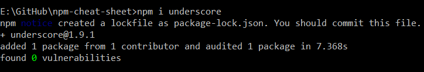

# Npm-cheat-sheet

An easy npm cheat sheet to makes developer life easier.
**NPM:** Npm is a command line tool for installing third-party node packages as well as the world’s largest software registry. Open-source developers use **npm** to share software.

### To check node version:

```bash
> node -v
```


### To check npm version:

```bash
> npm -v
```


### To initialize default package.json without answering any question:

**Package.json** file contains meta data about our application. All node applications by standard have at least one package.json file.

```bash
> npm init -y
```


### To install a package locally such as underscore:

```bash
> npm i <package-name>
> npm i underscore
```


